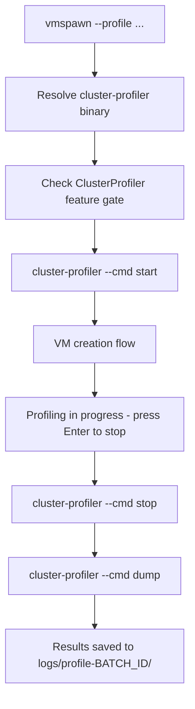

# Cluster Profiler Integration

vmspawn can profile the KubeVirt control plane during VM creation using the upstream
[cluster-profiler](https://github.com/kubevirt/kubevirt/blob/main/tools/cluster-profiler/cluster-profiler.go) tool.
This captures Go pprof data -- including CPU, memory (heap/allocs), goroutine, blocking, and mutex profiles --
from virt-api, virt-controller, virt-handler, and virt-operator pods,
helping identify performance bottlenecks caused by batch VM operations.

## Prerequisites

- The `ClusterProfiler` feature gate must be enabled on the KubeVirt CR (vmspawn can enable it automatically with user confirmation)
- `curl` or `wget` is required if the `cluster-profiler` binary is not already on your `$PATH` (for automatic download)

## Usage

```bash
# Profile all control-plane components during a 20-VM batch creation
./vmspawn --profile --vms=20 --namespaces=4

# Profile a specific component only
./vmspawn --profile=virt-controller --vms=20 --namespaces=4

# Combine with other options as usual
./vmspawn --profile --cloudinit=helpers/cloudinit-stress-workload.yaml --vms=50 --namespaces=10

# Dry-run to see what would happen
./vmspawn -n --profile --vms=10
```

The `--profile` flag accepts an optional component name to narrow the dump to a single component. If omitted, all control-plane components are dumped. Valid values for targeted profiling: `virt-api`, `virt-controller`, `virt-handler`, `virt-operator`.

## How it works

When `--profile` is specified, vmspawn wraps the normal VM creation flow with profiler lifecycle management:

1. **Binary resolution** -- find or download the `cluster-profiler` binary (see [Binary acquisition](#binary-acquisition) below)
2. **Feature gate check** -- verify `ClusterProfiler` is enabled; if not, prompt to enable it
3. **Start profiling** -- `cluster-profiler --cmd start` begins CPU profiling on all control-plane pods (memory and other profiles are captured as point-in-time snapshots during the dump phase)
4. **Normal VM creation** -- namespaces, DataVolumes, VolumeSnapshots, VMs (unchanged)
5. **Interactive stop** -- prompt the user to press Enter when ready to stop profiling
6. **Stop and dump** -- `cluster-profiler --cmd stop` followed by `cluster-profiler --cmd dump` (optionally with `-l kubevirt.io=<component>` for targeted profiling)



After VM creation completes, vmspawn displays:

```
=== Cluster profiling is in progress ===
KubeVirt control plane profiling is active (CPU, memory, goroutine, etc.).

Press Enter to stop profiling and dump results (or Ctrl+C to abort)...
```

This lets you keep the profiler running while VMs boot and settle, then stop when ready. Results are saved to `logs/profile-{BATCH_ID}/`.

## Binary acquisition

vmspawn resolves the `cluster-profiler` binary in this order:

| Priority | Source | When |
|---|---|---|
| 1 | `$PATH` | Binary already installed (e.g., built manually from kubevirt source) |
| 2 | `~/.vmspawn/bin/cluster-profiler` | Previously cached by vmspawn |
| 3 | GitHub Release download | First-time use; downloads pre-built binary from vmspawn releases |

### Automatic download

On first use, vmspawn downloads a pre-built Linux binary from the
[vmspawn GitHub Releases](https://github.com/gqlo/vmspawn/releases)
page using `curl` or `wget`, and caches it at
`~/.vmspawn/bin/cluster-profiler` for future runs.

The pre-built binary is a static Linux/amd64 binary compiled from the
upstream KubeVirt source. It is attached to vmspawn releases as the
`cluster-profiler-linux-amd64` asset.

### Manual installation

If you prefer to build manually (requires Go toolchain):

```bash
git clone --depth 1 https://github.com/kubevirt/kubevirt.git
cd kubevirt/tools/cluster-profiler
go build -o cluster-profiler .
sudo mv cluster-profiler /usr/local/bin/
```

## Feature gate management

The `ClusterProfiler` feature gate must be active for profiling to work. On OCP/CNV, the feature gate is enabled via a **jsonpatch annotation** on the HyperConverged CR (not a direct patch on the KubeVirt CR, which would be overwritten by the HCO operator).

### Enablement command

The simple case (no existing jsonpatch annotations):

```bash
oc annotate --overwrite -n openshift-cnv hco kubevirt-hyperconverged \
  kubevirt.kubevirt.io/jsonpatch='[{"op": "add", "path": "/spec/configuration/developerConfiguration/featureGates/-", "value": "ClusterProfiler"}]'
```

### Preserving existing annotations

If existing jsonpatch annotations are present (e.g., QPS rate and burst tuning), the patch must be applied all at once to prevent overwriting them. For example:

```bash
oc patch hco -n openshift-cnv kubevirt-hyperconverged --type=merge -p \
  '{"metadata":{"annotations":{"kubevirt.kubevirt.io/jsonpatch":"[{\"op\":\"add\",\"path\":\"/spec/configuration\",\"value\":{\"developerConfiguration\":{\"featureGates\":[\"ClusterProfiler\"]},\"apiConfiguration\":{\"restClient\":{\"rateLimiter\":{\"tokenBucketRateLimiter\":{\"burst\":400,\"qps\":200}}}},\"controllerConfiguration\":{\"restClient\":{\"rateLimiter\":{\"tokenBucketRateLimiter\":{\"burst\":400,\"qps\":200}}}},\"handlerConfiguration\":{\"restClient\":{\"rateLimiter\":{\"tokenBucketRateLimiter\":{\"burst\":100,\"qps\":50}}}},\"webhookConfiguration\":{\"restClient\":{\"rateLimiter\":{\"tokenBucketRateLimiter\":{\"burst\":400,\"qps\":200}}}}}}]"}}}'
```

### vmspawn behavior

vmspawn handles this automatically:

1. **Check** -- read the current `kubevirt.kubevirt.io/jsonpatch` annotation on the HCO CR
2. **Detect** -- determine if `ClusterProfiler` is already in the feature gates list
3. **Merge** -- if not present, merge the `ClusterProfiler` value into the existing annotation JSON (preserving any existing patches like QPS/burst tuning)
4. **Confirm** -- prompt the user before applying the change

```
ClusterProfiler feature gate is not enabled.
Enable it now? [y/N]
```

| Environment | Resource | Namespace |
|---|---|---|
| OCP with CNV | `HyperConverged/kubevirt-hyperconverged` (via annotation) | `openshift-cnv` |
| Upstream KubeVirt | `KubeVirt/kubevirt` (direct patch) | `kubevirt` |

## Output

Profiling results are saved under the batch's log directory, with one subdirectory per profiled pod:

```
logs/profile-{BATCH_ID}/
  virt-controller-546cb8f97f-bg4fp/
    allocs.pprof
    block.pprof
    cpu.pprof
    goroutine.pprof
    heap.pprof
    mutex.pprof
    threadcreate.pprof
  virt-controller-546cb8f97f-p6ntq/
    allocs.pprof
    ...
  virt-api-5f96f84dcb-lkpb7/
    allocs.pprof
    ...
  virt-handler-ccq6c/
    allocs.pprof
    ...
```

By default (`--profile` without a value), all control-plane components are dumped. When a specific component is targeted (e.g., `--profile=virt-controller`), only pods for that component appear in the output.

### Profile types

The `start`/`stop` commands **only control CPU profiling** -- they begin and end a
CPU sampling window. All other profile types (memory, goroutine, blocking, mutex,
threadcreate) are always available via Go's `net/http/pprof` endpoints and do not
require an explicit start/stop lifecycle. When the `dump` command runs, it retrieves
the CPU profile collected during the start-stop window **plus** point-in-time
snapshots of every other profile type:

| File | Type | Needs start/stop? | Description |
|---|---|---|---|
| `cpu.pprof` | CPU | **Yes** | CPU time profile -- where execution time is spent (sampled between start/stop) |
| `heap.pprof` | Memory | No | Current live heap allocations -- snapshot captured at dump time |
| `allocs.pprof` | Memory | No | Cumulative count of all past memory allocations -- snapshot at dump time |
| `goroutine.pprof` | Concurrency | No | Stack traces of all goroutines -- snapshot at dump time |
| `block.pprof` | Concurrency | No | Goroutine blocking profile (time spent waiting on synchronization) -- snapshot at dump time |
| `mutex.pprof` | Concurrency | No | Mutex contention profile (time spent waiting on locks) -- snapshot at dump time |
| `threadcreate.pprof` | Runtime | No | OS thread creation profile -- snapshot at dump time |

> **Why does only CPU need start/stop?** Go's CPU profiler works by sampling the
> call stack at regular intervals (typically 100 Hz). This sampling must be
> explicitly turned on and later turned off to bound the collection window. The
> other profiles are maintained by the Go runtime continuously and can be read at
> any moment as a point-in-time snapshot, so `dump` simply grabs them all at once
> alongside the accumulated CPU profile.

### Analyzing results

Use `go tool pprof` to analyze the collected profiles:

```bash
# Interactive CPU profile analysis
go tool pprof logs/profile-a3f7b2/virt-controller-546cb8f97f-bg4fp/cpu.pprof

# Generate a CPU profile plot (SVG)
go tool pprof -svg logs/profile-a3f7b2/virt-controller-546cb8f97f-bg4fp/cpu.pprof > cpu.svg

# Analyze memory (heap) profile
go tool pprof logs/profile-a3f7b2/virt-controller-546cb8f97f-bg4fp/heap.pprof

# Generate a memory allocation plot
go tool pprof -svg logs/profile-a3f7b2/virt-controller-546cb8f97f-bg4fp/allocs.pprof > allocs.svg

# Compare heap profiles between pod replicas
go tool pprof -diff_base=logs/profile-a3f7b2/virt-controller-546cb8f97f-bg4fp/heap.pprof \
    logs/profile-a3f7b2/virt-controller-546cb8f97f-p6ntq/heap.pprof
```

## Dry-run behavior

With `-n --profile`, vmspawn prints the profiling steps without executing them:

```
(dry-run) Would ensure cluster-profiler binary is available
(dry-run) Would check/enable ClusterProfiler feature gate
(dry-run) Would start profiling before VM creation
... normal dry-run VM creation output ...
(dry-run) Would prompt to stop profiling and dump results
```

## Limitations

- `--profile` cannot be combined with `--delete` or `--delete-all`
- The first run requires internet access to download the cluster-profiler binary (subsequent runs use the cached binary)
- Profiling captures KubeVirt control-plane components only, not guest VM internals
- The `ClusterProfiler` feature gate is left enabled after profiling completes; remove it manually if desired

## Files

| File | Description |
|---|---|
| [`helpers/profiler/Containerfile`](../helpers/profiler/Containerfile) | Multi-stage container build used by maintainers to produce the release binary |
| [`helpers/profiler/cluster-profiler.go`](../helpers/profiler/cluster-profiler.go) | Vendored copy of the upstream cluster-profiler source (Apache 2.0, for reference) |

## Label selectors

When using `--profile=COMPONENT`, vmspawn passes a label selector to the dump command to limit results to that component's pods. The available selectors are:

| Component | Label selector |
|---|---|
| virt-api | `-l kubevirt.io=virt-api` |
| virt-controller | `-l kubevirt.io=virt-controller` |
| virt-handler | `-l kubevirt.io=virt-handler` |
| virt-operator | `-l kubevirt.io=virt-operator` |

When `--profile` is used without a value, no label selector is passed and all components are dumped in a single invocation.

## References

- [KubeVirt PProf Profiler documentation](https://kubevirt.io/user-guide/debug_virt_stack/debug/#kubevirt-pprof-profiler)
- [Upstream cluster-profiler source](https://github.com/kubevirt/kubevirt/blob/main/tools/cluster-profiler/cluster-profiler.go)
- [Go pprof documentation](https://pkg.go.dev/net/http/pprof)
- [Julia Evans: Profiling Go with pprof](https://jvns.ca/blog/2017/09/24/profiling-go-with-pprof/)
